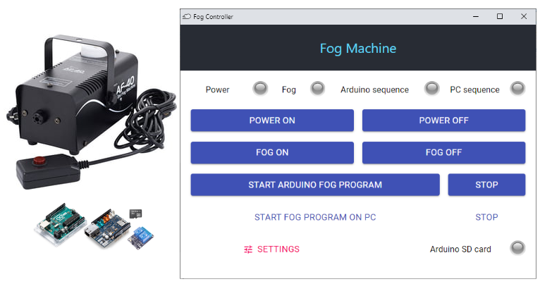
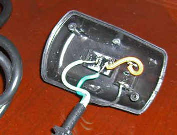
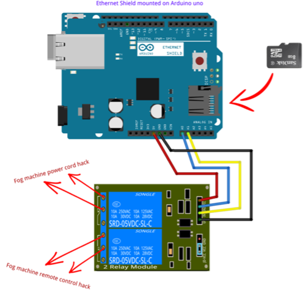
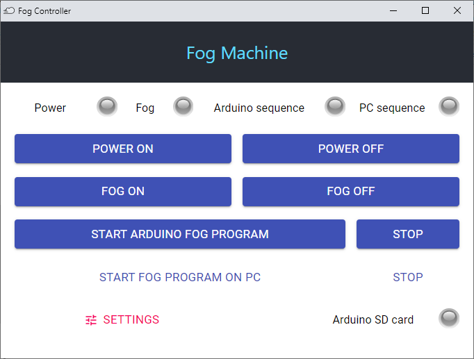
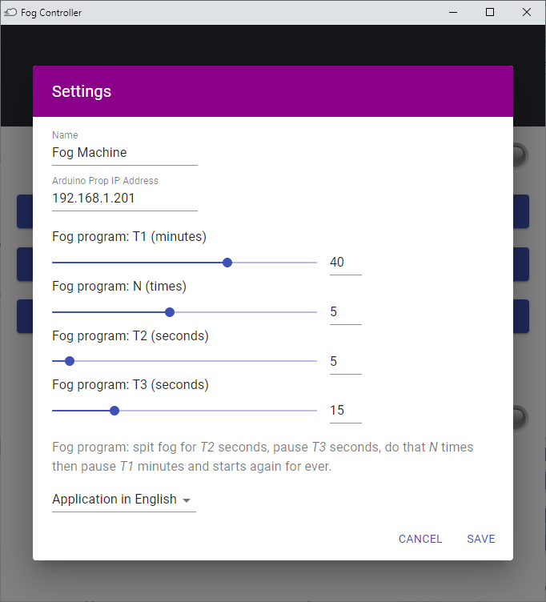

# Fog Machine Control
*Control a fog machine with Arduino UNO and NW.js React app.*




## Overview

The Fog Machine is one of the most popular props in Escape Rooms, offering spooky supernatural effects or revealing light or laser beams.


## What we need

* basic fog machine with a ***wired*** remote control
* Arduino UNO with Ethernet shield and SD card
* SRD relay shield

 120/220V **10A** relays are required because fog machine power is 400W - 700W or more.</src>


## Hacking the fog machine
It is as simple as cutting and rewiring the power cable and the remote control cable.

> Open the wired remote control box and replace the pushbutton connection with a connection to the SRD relay shield.

This video may help: 
* <a href="https://www.youtube.com/watch?v=Y6d89PBlxrk" target="_blank">Controlling a Fog Machine with a Prop Controller or Relay</a>




## Wiring the Arduino prop and the fog machine
The SD card is necessary to store the fog sequence but optional if you want to control the fog sequence from the controller app only:
> Fog sequence: spit fog for *T2* seconds, pause *T3* seconds, do that *N* times then pause *T1* minutes and starts again for ever.




## Edit and upload the Arduino sketch

Install lastest <a href="https://www.arduino.cc/en/software" target="_blank">Arduino IDE</a> and download the <a href="https://github.com/jim-blog/fog-machine/tree/master/arduino" target="_blank">FogMachine sketch</a> from this GitHub repository.

Open **FogMachine** sketch in Arduino IDE and set the Arduino IP address:

```cpp
String ip = "192.168.1.201"; //<<< ENTER YOUR IP ADDRESS HERE
```

Upload **FogMachine** sketch to the Arduino

```dos
Sketch uses 26748 bytes (82%) of program storage space. Maximum is 32256 bytes.
Global variables use 1197 bytes (58%) of dynamic memory, leaving 851 bytes for local variables. Maximum is 2048 bytes.

```


## Install Fog Controller app for Windows

Download and unzip the app archive:
* <a href="https://github.com/jim-blog/fog-machine/raw/master/bin/win64/fog-controller-win64.zip">fog-controller-win64.zip</a> (92.1 MB)

Alternatively, download the `.7z` app archive and unzip with <a href="https://www.7-zip.org/" target="_blank">7-Zip</a>:
* <a href="https://github.com/jim-blog/fog-machine/raw/master/bin/win64/fog-controller-win64.7z">fog-controller-win64.7z</a> (64.6 MB)

Run `fog-controller.exe`
> If necessary, pass protection *Windows Smartscreen* that prevents the execution of the downloaded file.



<a href="https://github.com/jim-blog/fog-machine/tree/master/src" target="_blank">Fog Controller app source code</a> is available from this GitHub repository, as a Javascript coder, feel free to fork and hack your own controller app.


## Set the Fog program sequence
Fog program sequence: 
* spit fog for *T2* seconds, pause *T3* seconds, do that *N* times then pause *T1* minutes and starts again for ever.




## Fog prop in Escape Room

### Houdini MC users

<a href="https://houdinimc.com/" target="_blank">Houdini MC</a> control props with HTTP GET/POST requests (see <a href="https://houdinimc.com/2018/04/13/interact-with-a-controller/" target="_blank">Interacting with a Controller (e.g. Arduino/Raspberry Pi) tutorial</a>).


### Escape Room Master users


### xcape.io Room users


### Arduino FogMachine API

| API                      | RESPONSE             | DESCRIPTION                            |
|--------------------------|----------------------|----------------------------------------|
| GET /fog/1               | 200 - OK             | Activate fog relay                     |
| GET /fog/0               | 200 - OK             | Dectivate fog relay                    |
| GET /power/1             | 200 - OK             | Activate power relay                   |
| GET /power/0             | 200 - OK             | Deactivate power relay                 |
| GET /sequence/1          | 200 - OK             | Start fog program sequence             |
| GET /sequence/0          | 200 - OK             | Stop fog program sequence              |
| GET /settings/37,3,5,15  | 200 - OK             | Set T1,N,T2,T3                         |
| GET /                    | `37|3|5|15|0|0|0|0`  | `T1|N|T2|T3|power|fog|sequence|sd card`|


## What next ?
You'll find here all the source code to hack and build your own Fog Controller app or Arduino FogMachine sketch:
* app is available in English and French, you can easily add your own language
* you can replace the Arduino Ethernet Shield with Arduino Nano, Arduino MKR Wifi 1010 or any other Arduino compatible board
* all the source code is available in this repository with some documentation:
    - <a href="https://github.com/jim-blog/fog-machine/tree/master/docs/developer/electronics" target="_blank">Electronics with `fog_machine.fz`z Fritzing project</a>
    - <a href="https://github.com/jim-blog/fog-machine/tree/master/docs/developer/arduino" target="_blank">Arduino developer notes</a>
    - <a href="https://github.com/jim-blog/fog-machine/tree/master/docs/developer/app" target="_blank">NW.js React developer notes</a>
        

## Author

**Jean-Michel _(Jim)_ FAURE** (December 8th, 2020)
* company: FAURE SYSTEMS®
* mail: *dev at faure dot systems*
* github: <a href="https://github.com/fauresystems" target="_blank">fauresystems</a>
* web: <a href="https://faure.systems/" target="_blank">Faure●Systems</a>